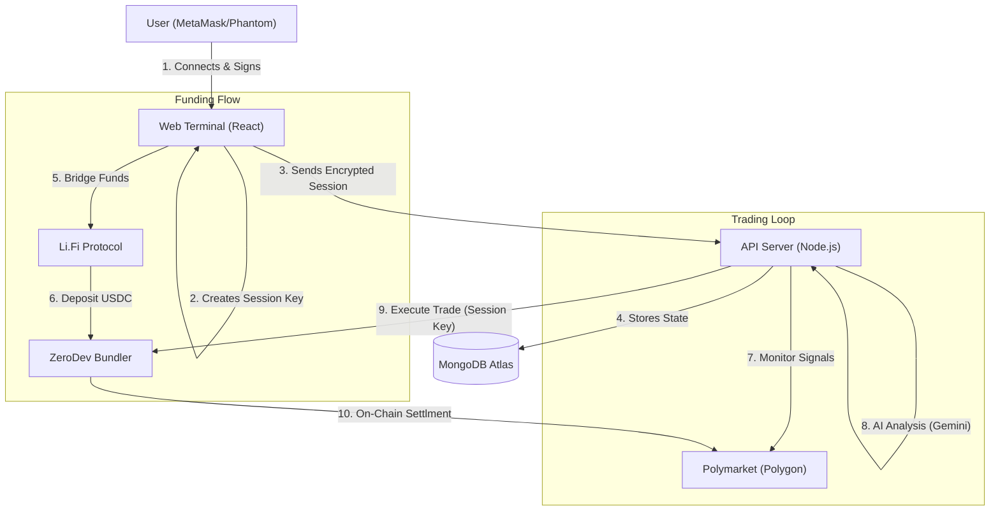

# 🏛️ Bet Mirror Pro | Technical Architecture

> **Enterprise-Grade Trading Infrastructure**
> A hybrid cloud architecture leveraging Account Abstraction for non-custodial security, MongoDB for robust state persistence, and AI for risk analysis.

---

## 1. System Overview

Bet Mirror Pro is designed to solve the "Trust Problem" in automated trading. Traditional trading bots require users to surrender their private keys to a server. If the server is hacked, the user loses everything.

**Our Solution: Account Abstraction (ERC-4337)**
We separate the **Owner** (The User) from the **Trader** (The Bot).

### Core Components
1.  **Frontend (React/Vite):** The command center. Users connect wallets, bridge funds, and configure risk profiles.
2.  **Smart Accounts (ZeroDev/Kernel):** On-chain programmable wallets that hold the funds.
3.  **Bot Server (Node.js):** A high-frequency engine that monitors the blockchain and executes trades using restricted session keys.
4.  **Database (MongoDB Atlas):** Persistent storage for user state, trade history, and encrypted session credentials.

---

## 2. High-Level Data Flow



---

## 3. Account Abstraction (Deep Dive)

We utilize **ZeroDev** and the **Kernel v3.1** smart account standard to implement ERC-4337.

### Why is this secure?
In a standard EOA (Externally Owned Account) wallet, the Private Key can do everything: Trade, Transfer, Burn.
In our Smart Account architecture, we use **Session Keys**.

### The Key Hierarchy

| Key Type | Location | Permission Level | Expiry |
| :--- | :--- | :--- | :--- |
| **Owner Key** | User's Hardware/Web Wallet | **Root Admin**. Can withdraw funds, revoke keys, update settings. | Never |
| **Session Key** | Encrypted in MongoDB | **Restricted**. Can ONLY call `createOrder` on Polymarket. Cannot transfer USDC out. | 30 Days |

### Trustless Withdrawal
Because the User is the "Owner" of the Smart Contract on the blockchain, they can interact with it directly, bypassing our server entirely.
1.  User signs a `UserOperation` on the frontend.
2.  The operation calls `transfer(usdc, userAddress, balance)`.
3.  This operation is submitted to the bundler.
4.  The Smart Account executes it immediately.
*The bot server cannot stop this process.*

---

## 4. Data Persistence & Recovery

We have migrated from ephemeral `JSON/LocalStorage` to a production-grade **MongoDB** cluster. This ensures reliability during deployments or crashes.

### Database Schema Strategy

*   **Users Collection:** 
    *   Stores the `SmartAccountAddress`.
    *   Stores the `SerializedSessionKey` (needed to rebuild the signing instance on server restart).
    *   Stores `BotConfig` (Targets, Multipliers, Risk Profile).
    *   Stores `ActivePositions` (Entry prices for PnL calculation).

*   **Trades Collection:**
    *   Immutable log of every action.
    *   Includes `AIReasoning` strings and `RiskScores`.

*   **Registry Collection:**
    *   Stores the Alpha Marketplace data.
    *   Tracks `CopyCount` and `ProfitGenerated` for revenue sharing calculations.

### Auto-Recovery Protocol
1.  **Server Restart:** When the Node.js process restarts (e.g., new deployment), memory is wiped.
2.  **Rehydration:** The server queries MongoDB for all users with `isBotRunning: true`.
3.  **State Reconstruction:** It pulls the `ActivePositions` and `SessionKey` from the DB.
4.  **Resume:** The bot calculates the `StartCursor` (timestamp of the last known trade) and resumes monitoring from that exact second. **No trades are missed.**

---

## 5. Technology Stack & External Services

### Infrastructure
*   **Hosting:** Dockerized Node.js (Sliplane/Railway/AWS).
*   **Database:** MongoDB Atlas (M0/M10 Cluster).

### Web3 Providers
*   **ZeroDev:** AA Bundler & Paymaster (Gas sponsorship).
*   **Li.Fi:** Cross-chain bridging (Any Chain -> Polygon).
*   **Polymarket CLOB:** Order book interaction.
*   **Viem:** TypeScript interface for Ethereum.

### AI
*   **Google Gemini 2.5 Flash:** Extremely low latency model used to analyze prediction market questions (e.g., "Will Bitcoin hit 100k?") against the user's risk profile (Conservative/Degen) to prevent "bad" copies.

---
## 6. Directory Structure

```
src/
├── app/                 # CLI Entry points
├── config/              # Env variables & Constants
├── database/            # MongoDB Connection & Mongoose Models (User, Trade, Registry)
├── domain/              # TypeScript Interfaces (Types)
├── infrastructure/      # External Clients (Polymarket)
├── server/              # Backend API & Bot Engine
├── services/            # Core Logic
│   ├── ai-agent.service.ts       # Gemini Risk Analysis
│   ├── lifi-bridge.service.ts    # Cross-Chain Bridging
│   ├── zerodev.service.ts        # Account Abstraction
│   ├── trade-executor.service.ts # Execution Logic
│   ├── trade-monitor.service.ts  # Signal Detection
│   └── web3.service.ts           # Client-side Wallet Interaction
└── utils/               # Helpers
```

---

## 7. Roadmap

### Phase 1: Managed SaaS (Completed)
- [x] Server-side execution.
- [x] Basic EOA support.

### Phase 2: Persistence & Scale (Completed)
- [x] Migration from JSON files to **MongoDB**.
- [x] Auto-recovery of bots after server restart.
- [x] Centralized Trade History API.

### Phase 3: Account Abstraction (Current)
- [x] ZeroDev Smart Account integration.
- [x] Session Key delegation.

### Phase 4: Decentralized Registry (Next)
- [ ] Move the `Registry` MongoDB collection to an on-chain Smart Contract.
- [ ] Listers stake tokens to verify performance.
- [ ] Fee distribution handles automatically via smart contract splits.

---

## 8. External Resources

*   [ZeroDev Documentation](https://docs.zerodev.app/) - Account Abstraction SDK.
*   [ERC-4337 Specification](https://eips.ethereum.org/EIPS/eip-4337) - The standard for Smart Accounts.
*   [Polymarket API](https://docs.polymarket.com/) - CLOB & Data API.
*   [Li.Fi Docs](https://docs.li.fi/) - Cross-chain bridging SDK.

