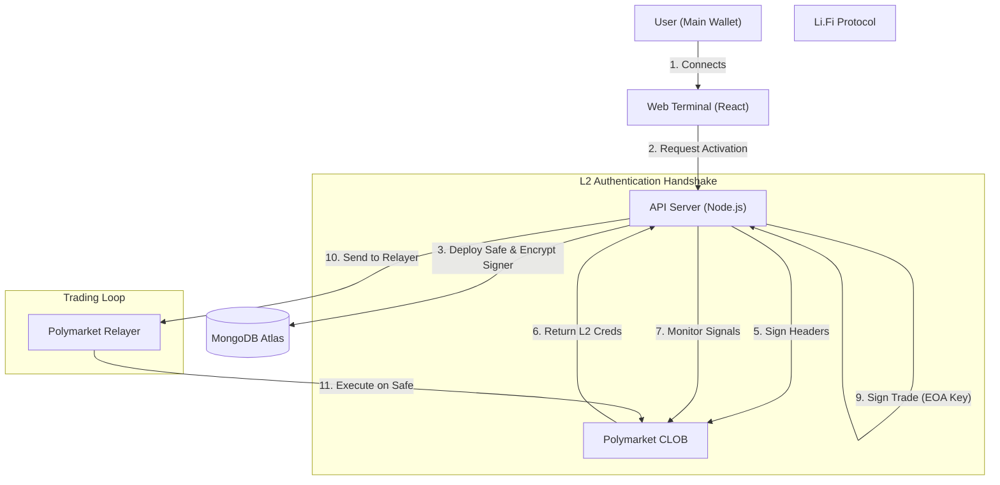

# 🏛️ Bet Mirror Pro | Technical Architecture

> **Enterprise-Grade Trading Infrastructure**
> A hybrid cloud architecture leveraging Dedicated Gnosis Safes, MongoDB for robust state persistence, and AI for risk analysis.

---

## 1. System Overview

Bet Mirror Pro solves the complexity of programmatic trading on Polymarket's CLOB. It manages the cryptographic requirements, API handshakes, and execution logic so users can focus on strategy.

### Core Components
1.  **Frontend (React/Vite):** The command center. Users connect wallets, bridge funds, and configure risk profiles.
2.  **Trading Wallets (Gnosis Safe):** Dedicated Smart Contracts (Proxy Wallets) deployed on Polygon. They hold the funds and positions.
3.  **Bot Server (Node.js):** A high-frequency engine that monitors the blockchain and executes trades by signing instructions for the Safes.
4.  **Database (MongoDB Atlas):** Persistent storage for user state, trade history, and **AES-256 Encrypted** keys.

---

## 2. High-Level Data Flow

---

## 3. The Security Hierarchy (Hybrid Model)

To interact with Polymarket's CLOB efficiently while maintaining security and attribution, we use a **Hybrid Safe Model**.

| Key Type | Location | Storage | Function |
| :--- | :--- | :--- | :--- |
| **Main Wallet** | User's Device | MetaMask/Phantom | **Fund Source.** Used to deposit to and receive withdrawals from the bot. |
| **Signer EOA** | Bot Server | **Encrypted (AES-256)** | **Controller.** The EOA that has authority to sign transactions for the Safe. It holds *no funds*, only gas (optional, as Relayer pays gas). |
| **Gnosis Safe** | Blockchain | Smart Contract | **Vault.** Holds the USDC.e capital and open positions. The Signer controls this vault. |

### Why Gnosis Safe + Relayer?
We previously explored standard EOAs and ZeroDev. We settled on the **Polymarket Relayer + Safe** architecture for three reasons:
*   **Gasless Experience:** The Polymarket Relayer pays the MATIC gas fees for all trades and transfers.
*   **Builder Attribution:** Transactions sent via the Relayer allow us to inject Builder ID headers, ensuring proper volume attribution.
*   **Institutional Standard:** Gnosis Safe is the gold standard for on-chain asset custody.

---

## 4. Data Persistence & Recovery

We use a production-grade **MongoDB** cluster.

### Database Schema Strategy
*   **Users Collection:** Stores `TradingWalletConfig` (Signer Address + Safe Address), `EncryptedPrivateKey`, and `BotConfig`.
*   **Trades Collection:** Immutable log of every action with `AIReasoning`.
*   **Registry Collection:** Tracks `CopyCount` and `ProfitGenerated` for the marketplace.

### Auto-Recovery
1.  **Server Restart:** When the Node.js process restarts, memory is wiped.
2.  **Rehydration:** The server queries MongoDB for all users with `isBotRunning: true`.
3.  **Resume:** The bot decrypts the keys into memory, re-initializes the `SafeManager`, and resumes monitoring immediately.

---

## 5. Technology Stack

*   **Frontend:** React 19, Vite, TailwindCSS, Lucide Icons.
*   **Backend:** Node.js, Express, TypeScript.
*   **Database:** MongoDB Atlas.
*   **Blockchain:** Viem & Ethers.js.
*   **Execution:** `@polymarket/builder-relayer-client` & `@polymarket/clob-client`.
*   **Bridge:** Li.Fi SDK.
*   **AI:** Google Gemini 2.5 Flash.
