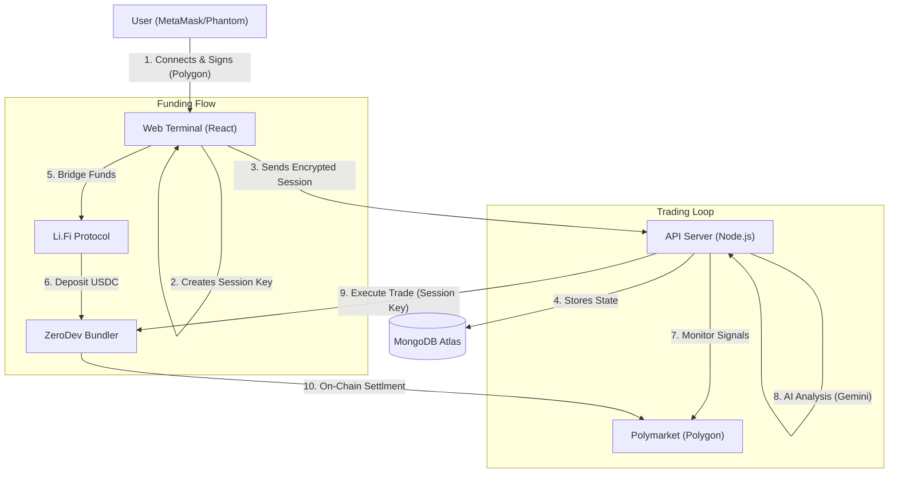

# Bet Mirror | Pro Cloud Terminal


**Institutional-grade Polymarket Copy Trading Terminal. Features Non-Custodial Smart Accounts (ERC-4337), AI Risk Analysis (Gemini), and Cross-Chain funding via Li.Fi.**

**Bet Mirror Pro** is an enterprise-grade trading terminal designed to democratize algorithmic prediction market trading. Unlike traditional bots that require custodial private keys, Bet Mirror leverages **ERC-4337 Account Abstraction** to offer a fully non-custodial solution. Users retain full control of their funds while granting restricted "Session Keys" to a cloud-based engine that executes trades 24/7 based on **AI Risk Analysis** and **Copy Trading signals**. The platform includes a built-in "Alpha Registry" marketplace, rewarding top traders with a 1% protocol fee from every copier.

Developed by **PolyCafe**.


---

## 🚀 How It Works

Bet Mirror Pro transforms complex algorithmic trading into a simple 3-step process for the end user.

### 1. The Smart Onboarding
- **Connect:** User connects their standard EOA (Metamask, Phantom, Rainbow).
- **Network Check:** The app will prompt you to switch to **Polygon** to sign the activation. 
  > *Why?* Your Smart Account lives on Polygon. Even if your funds are on Base or Solana, your Wallet acts as the "Root Admin" on the Polygon network to control the bot.
- **Deploy:** The app automatically deploys a **ZeroDev Smart Account** (Kernel v3.1) owned by your wallet.
- **Session Keys:** You sign a specific "Session Key" that grants the Bot Server permission to **Trade Only**. The server cannot withdraw funds.

### 2. The Cloud Engine (Server-Side)
- **Persistence:** Once the bot is started, it runs on our Node.js cloud cluster backed by **MongoDB**.
- **Offline Trading:** The user can close their browser or turn off their computer. The bot continues to monitor markets and execute trades 24/7.
- **AI Analysis:** Before every trade, the **Google Gemini 2.5** Agent analyzes the market question to ensure it aligns with the user's risk profile (Conservative, Balanced, or Degen).

### 3. The Marketplace & Profit
- **Copy Trading:** Users browse the **Alpha Registry** to find whales with high win rates.
- **Fee Sharing:** When a user profits from a copied trade, a **1% fee** is automatically sent to the original trader (The Lister) and **1%** to the Platform.
- **Trustless Withdraw:** Users can trigger a forced withdrawal from the dashboard at any time, bypassing the server entirely.

---

## 📈 Live Analytics Engine

The Alpha Marketplace is now powered by a dedicated **Registry Analytics Service** (`src/services/registry-analytics.service.ts`).

*   **Real-Time Data:** The system fetches raw trade history from the Polymarket Data API for every listed wallet.
*   **Win Rate Calculation:** It tracks "Round Trip" trades (Buying an outcome and Selling it later) to calculate realized PnL and Win Rates accurately.
*   **Auto-Update:** A background worker updates these stats in the MongoDB Registry every 15 minutes.
*   **Deep Dive:** Users can click on any trader in the Marketplace to see a detailed modal with their last 50 transactions, helping them make informed copy decisions.

---

## 👷 Builder Program Integration

This platform is a registered **Polymarket Builder**. Every trade executed by the bot is cryptographically stamped with attribution headers.

**To configure your Builder Keys (For Platform Admins):**
Add the following to your `.env` file:

```env
POLY_BUILDER_API_KEY=your_builder_key
POLY_BUILDER_SECRET=your_builder_secret
POLY_BUILDER_PASSPHRASE=your_passphrase
```

The system will automatically initialize the `BuilderConfig` and stamp all outgoing orders.

---

## 📋 Managing Official Wallets (System Seeding)

You can seed the Marketplace with "Official" or "System" wallets (e.g., trusted whales) using a simple text file. This keeps your `.env` clean.

1.  **Create a file:** Create a file named `wallets.txt` in the root directory.
2.  **Add Addresses:** Paste wallet addresses using any of the following formats:

**Option A: Newlines (Recommended)**
```text
0x8894e0a0c962cb723c1976a4421c95949be2d4e3
0xd8dA6BF26964aF9D7eEd9e03E53415D37aA96045
```

**Option B: Commas**
```text
0x8894..., 0xd8dA..., 0x1234...
```

*The server will automatically load these on startup, deduplicate them, mark them as "OFFICIAL" in the database, and display them with a badge in the Marketplace UI.*

---

## 🖥️ Interface Preview

### 📊 The Dashboard
The command center. View your Real-Time PnL, Active Positions, and System Logs.
> *Displays wallet balances (Native & Smart Account), Live Trade Console, and Performance Metrics.*

### 🔒 The Vault
Security first. Configure your AI Risk settings and manage automation.
> *Manage API Keys, Risk Profiles (Conservative/Degen), Auto-Cashout thresholds, and SMS Notification settings.*

### 🌍 The Alpha Registry
A decentralized marketplace for trading signals.
> *A leaderboard of top Polymarket traders. Users can "One-Click Copy" any wallet listed here. Listers earn passive income from copiers.*

### 🌉 Cross-Chain Bridge
Fund your bot from anywhere.
> *Integrated Li.Fi Widget allows deposits from Ethereum, Base, Solana, and Arbitrum directly into the Polygon Smart Account.*

---

## 🏗 System Architecture

The platform uses a hybrid architecture combining the speed of centralized execution with the security of decentralized custody.

[📖 **Read the Full Architecture Guide**](./ARCHITECTURE.md)



---

## 3. Account Abstraction (Deep Dive)

We utilize **ZeroDev** and the **Kernel v3.1** smart account standard to implement ERC-4337.

### Why is this secure?
In a standard EOA (Externally Owned Account) wallet, the Private Key can do everything: Trade, Transfer, Burn.
In our Smart Account architecture, we use **Session Keys**.

### The Key Hierarchy

| Key Type | Location | Permission Level | Expiry |
| :--- | :--- | :--- | :--- |
| **Owner Key** | User's Wallet (Browser) | **Root Admin**. Can withdraw funds, revoke keys, update settings. | Never |
| **Session Key** | Encrypted in MongoDB | **Restricted**. Can ONLY call `createOrder` on Polymarket. Cannot transfer USDC out. | 30 Days |

### Trustless Withdrawal
Because the User is the "Owner" of the Smart Contract on the blockchain, they can interact with it directly, bypassing our server entirely.
1.  User signs a `UserOperation` on the frontend.
2.  The operation calls `transfer(usdc, userAddress, balance)`.
3.  This operation is submitted to the bundler.
4.  The Smart Account executes it immediately.
*The bot server cannot stop this process.*

---

## 4. Data Persistence & Recovery

We have migrated from ephemeral `JSON/LocalStorage` to a production-grade **MongoDB** cluster. This ensures reliability during deployments or crashes.

### Database Schema Strategy

*   **Users Collection:** 
    *   Stores the `SmartAccountAddress`.
    *   Stores the `SerializedSessionKey` (needed to rebuild the signing instance on server restart).
    *   Stores `BotConfig` (Targets, Multipliers, Risk Profile).
    *   Stores `ActivePositions` (Entry prices for PnL calculation).

*   **Trades Collection:**
    *   Immutable log of every action.
    *   Includes `AIReasoning` strings and `RiskScores`.

*   **Registry Collection:**
    *   Stores the Alpha Marketplace data.
    *   Tracks `CopyCount` and `ProfitGenerated` for revenue sharing calculations.

### Auto-Recovery Protocol
1.  **Server Restart:** When the Node.js process restarts (e.g., new deployment), memory is wiped.
2.  **Rehydration:** The server queries MongoDB for all users with `isBotRunning: true`.
3.  **State Reconstruction:** It pulls the `ActivePositions` and `SessionKey` from the DB.
4.  **Resume:** The bot calculates the `StartCursor` (timestamp of the last known trade) and resumes monitoring from that exact second. **No trades are missed.**

---

## 5. Technology Stack & External Services

### Infrastructure
*   **Hosting:** Dockerized Node.js (Sliplane/Railway/AWS).
*   **Database:** MongoDB Atlas (M0/M10 Cluster).

### Web3 Providers
*   **ZeroDev:** AA Bundler & Paymaster (Gas sponsorship).
*   **Li.Fi:** Cross-chain bridging (Any Chain -> Polygon).
*   **Polymarket CLOB:** Order book interaction.
*   **Viem:** TypeScript interface for Ethereum.

### AI
*   **Google Gemini 2.5 Flash:** Extremely low latency model used to analyze prediction market questions (e.g., "Will Bitcoin hit 100k?") against the user's risk profile (Conservative/Degen) to prevent "bad" copies.

---

## 6. External Resources

*   [ZeroDev Documentation](https://docs.zerodev.app/) - Account Abstraction SDK.
*   [ERC-4337 Specification](https://eips.ethereum.org/EIPS/eip-4337) - The standard for Smart Accounts.
*   [Polymarket API](https://docs.polymarket.com/) - CLOB & Data API.
*   [Li.Fi Docs](https://docs.li.fi/) - Cross-chain bridging SDK.
